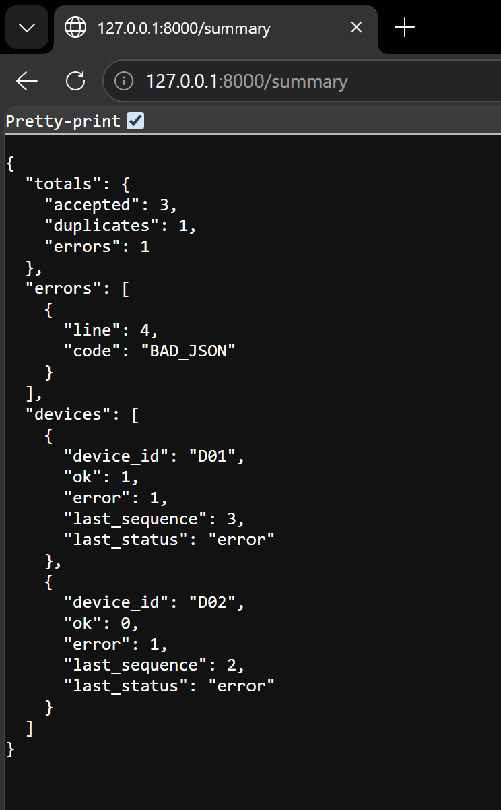
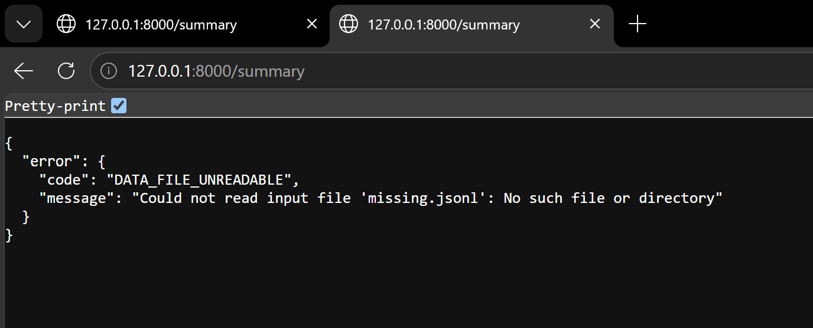
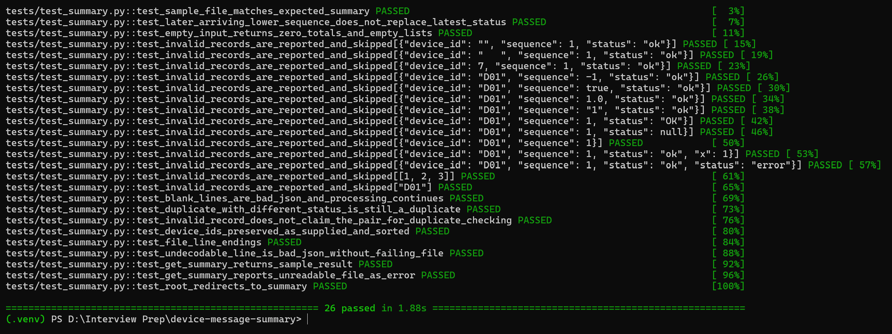

# Walkthrough

A written walkthrough of the project, in place of a video. The outputs below come from running the current code.

## 1. Overview and layout

The service reads a JSON Lines file of device messages and returns a summary: totals, an ordered error list and per-device stats.

```
device_summary/summarizer.py   core logic, a pure function over lines (no HTTP)
device_summary/api.py          FastAPI app: GET /summary, and GET / redirects to it
data/sample.jsonl              sample input from the brief
tests/test_summary.py          pytest suite (26 tests)
```

The core is `summarize_lines(lines)`, which takes a list of strings and returns a dict. `summarize_file(path)` only reads bytes and splits them into lines. `api.py` only calls `summarize_file` and turns an `OSError` into an error response. So every rule can be tested without starting a server.

Each line is processed in four steps, stopping at the first failure:

1. **Parse.** Blank lines and invalid JSON are `BAD_JSON`. A repeated key, such as two `status` fields, is `INVALID_RECORD`.
2. **Validate.** The keys must be exactly `device_id`, `sequence` and `status`. `device_id` must be a non-blank string. `sequence` must be an integer of 0 or more, and not a boolean. `status` must be `ok` or `error`.
3. **Deduplicate** on `(device_id, sequence)`. The first occurrence wins.
4. **Update the device's stats.** `last_status` changes only when the sequence is higher than the highest one seen so far.

## 2. Main flow: the sample file

```powershell
uvicorn device_summary.api:app
# open http://127.0.0.1:8000/summary
```

`GET /summary` returns **HTTP 200**:

```json
{
  "totals": {"accepted": 3, "duplicates": 1, "errors": 1},
  "errors": [{"line": 4, "code": "BAD_JSON"}],
  "devices": [
    {"device_id": "D01", "ok": 1, "error": 1, "last_sequence": 3, "last_status": "error"},
    {"device_id": "D02", "ok": 0, "error": 1, "last_sequence": 2, "last_status": "error"}
  ]
}
```

- Line 2 repeats `D01` / sequence 1, so it counts as a duplicate.
- Line 4 is cut off in the middle of the JSON, so it is `BAD_JSON`. That is why there is no `D03` row.
- `D01` has sequences 1 (`ok`) and 3 (`error`). Its latest status is `error` because 3 is the highest sequence.

`GET /` returns **HTTP 307** with `location: /summary`, so opening the bare URL lands on the summary.



## 3. Failure case: missing input file

```powershell
$env:DEVICE_DATA_FILE="missing.jsonl"; uvicorn device_summary.api:app
# afterwards: Remove-Item Env:DEVICE_DATA_FILE
```

`GET /summary` returns **HTTP 503**:

```json
{"error": {"code": "DATA_FILE_UNREADABLE", "message": "Could not read input file 'missing.jsonl': No such file or directory"}}
```

An unreadable file is reported as a failure, never as an empty summary with zero totals, so a client can tell "no data" apart from "couldn't read the data".



## 4. Tests

```powershell
pytest -v
```

Result: **26 passed**.

- **The three tests the brief requires come first:** the exact sample summary, a lower sequence that arrives later and must not replace the latest status, and empty input.
- **Validation edge cases:**
  - empty and whitespace-only IDs
  - a non-string ID
  - negative, boolean, float and string sequences
  - wrong-case or null status
  - missing, extra and repeated keys
  - JSON that isn't an object
- **Blank lines** are `BAD_JSON`, and processing continues after them.
- **A duplicate with a different status** is still a duplicate.
- **An invalid line does not claim its `(device_id, sequence)` pair**, so a later valid line with the same pair is still accepted.
- **Device IDs** are kept exactly as supplied and sorted.
- **Line endings:** CRLF works, and a trailing newline doesn't create a phantom blank line.
- **Invalid UTF-8** makes only that line `BAD_JSON`; the rest of the file is still processed.
- **HTTP:** a 200 for the sample, a 503 for a missing file, and the 307 redirect from `/`.



## 5. Design decisions and fixes

- **Validate before deduplicating.** Only a valid record can claim a `(device_id, sequence)` pair. Otherwise a broken line would cause the real record after it to be thrown away as a "duplicate".
- **The latest status comes from the highest sequence, not the last arrival.** Messages can arrive out of order. An older message is still counted, but it never overwrites the current state.
- **Reviewed and kept:** The first draft decoded with `errors="replace"`, which turned `"D\xff"` into `"D�"` and accepted it as a different device ID. This was changed to strict per-line decoding, so a line that can't be decoded becomes `BAD_JSON`, and I kept a test for it.
- **Repeated keys are rejected.** Python's `json` normally keeps the last value, which would quietly make a line with two `status` fields look valid.
- **503 for an unreadable file.** The service is running but can't reach its data. A 500 would also be defensible.
- **Defect found and fixed:** While testing manually I opened the bare URL and got a 404, because the only route was `/summary`. I added a 307 redirect from `/` to `/summary`, and a test that checks the redirect itself.
- **Known limitation.** The whole file is read into memory, and the set of seen pairs grows with the input. A large or continuous stream would need streaming reads and a bounded dedup store.
